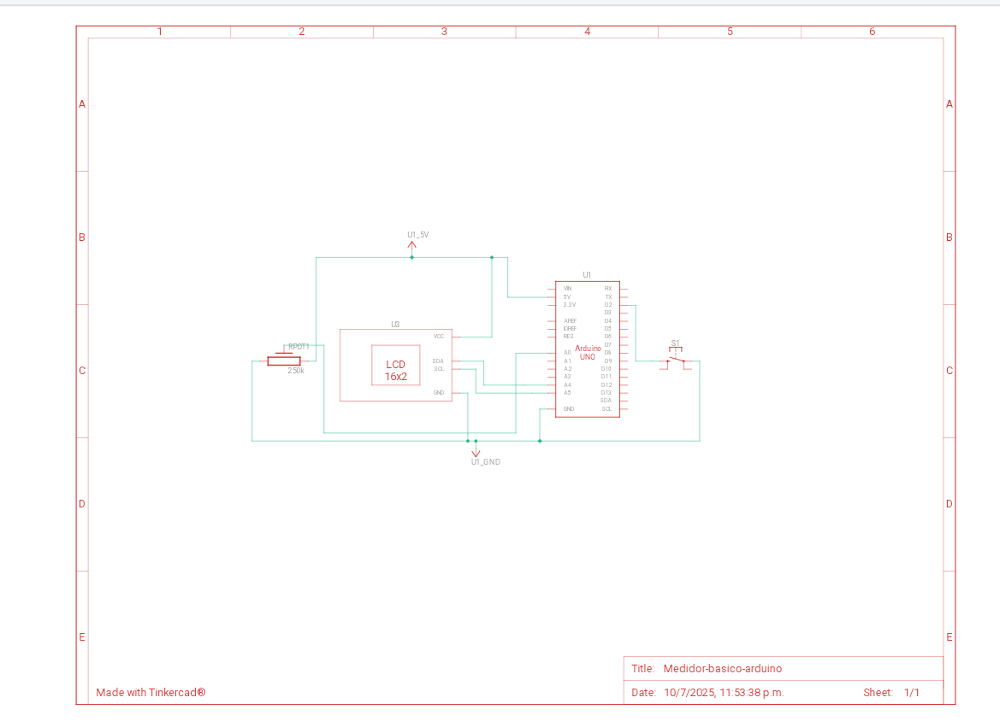
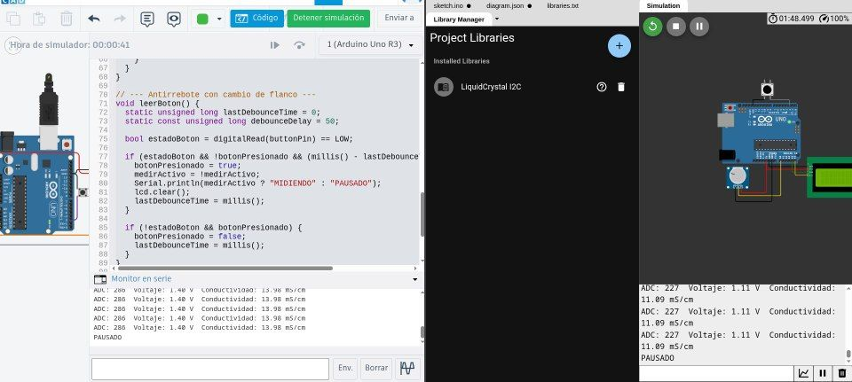

# Medidor de Salinidad Básico con Arduino UNO


[](https://github.com/paupau77/Arduino-para-mi-dispositivo-/Issues)


Dispositivo básico para medir la conductividad eléctrica de una muestra líquida (simulada con un potenciómetro), mostrando en pantalla LCD 16x2 I2C el voltaje, valor ADC y una estimación simple de la conductividad. Está preparado para incorporar una fórmula profesional que convierta la conductividad a salinidad real (g/L, ppt, etc) cuando se disponga.

Este proyecto fue creado con mucho ❤️ para ayudar en monitoreo de salud, química, biología, etc

---

## 📋 Índice

- 🔧 Componentes
- 🔌 Esquema de conexión
- 📷 Esquemas & simuladores
- 🧠 Funcionamiento del sistema  
- 💻 Código Arduino destacado
- 🧠 Funcionamiento del código  
- 🧪 Estado actual  
- 🚀 Posibles mejoras futuras
- 💖 Mi proyecto fue hecho desde el corazón
- ♥️ Agradecimientos
- 🙌 Créditos
- 📄 Licencia  
- ✍️ Autora

---

##  🔧 Componentes

| Componente              | Cantidad             |
|------------------------|----------------------|
| Arduino UNO / Nano / compatible | 1                    |
| Sensor de conductividad (analógico) | 1                    |
| Pantalla OLED SSD1306 (I2C) o LCD 16x2 I2C | 1              |
| Pulsador                | 1                    |
| Protoboard o placa perforada | 1                    |
| Cables dupont           | Varios               |

---

##  🔌 Esquema de conexión

- **Sensor de conductividad:**  
  - Salida analógica → Pin `A0` del Arduino

- **Pantalla OLED SSD1306 (I2C) o LCD 16x2 I2C:**  
  - SDA → Pin `A4` (Arduino UNO/Nano)  
  - SCL → Pin `A5` (Arduino UNO/Nano)  
  - VCC → 5V (ambas son compatibles con 5V en la mayoría de los módulos)  
  - GND → GND  

- **Pulsador:**  
  - Un extremo a pin digital `2`  
  - Otro extremo a GND  
  - Pin configurado con `INPUT_PULLUP` (no requiere resistencia externa)

- **Alimentación:**  
  - Fuente estable de 5V o conexión USB  

---

## 📷 Esquema de conexión del circuito


*Figura 1: Diagrama de conexión entre Arduino, sensor de conductividad, pantalla y pulsador.*

---

## 📷 Desde los simuladores



*Figura 2: Esquema de la simulación de Tinkercad.*



*Figura 3: El dispositivo en los simuladores.*

---

## 🧠 Funcionamiento del sistema

- Lee periódicamente el valor analógico del sensor (potenciómetro en este prototipo) conectado al pin A0.  
- Convierte ese valor ADC a voltaje y calcula una conductividad aproximada usando un valor máximo predefinido (50 mS/cm).  
- Muestra en la pantalla LCD:  
  - Voltaje medido  
  - Conductividad estimada (mS/cm)  
  - Valor ADC (0-1023)  
- Envía los mismos datos por el puerto serie para monitoreo externo.  
- Permite controlar el estado con un botón:  
  - Pulsación corta: alterna entre medición activa y pausa  
  - En pausa, muestra mensaje indicándolo y detiene la actualización de datos  

---

##  💻 Código Arduino destacado

- Usa la librería `LiquidCrystal_I2C` para controlar la pantalla LCD 16x2 vía I2C.  
- Implementa antirrebote software para lectura estable del botón.  
- La fórmula para convertir ADC a conductividad está parametrizada con una variable `maxConductividad`.  
- **Preparado para incorporar la fórmula profesional que convierta conductividad a salinidad real**, con un bloque comentado para añadir la ecuación bioquímica cuando esté disponible:  

```cpp
// ⚠️ FÓRMULA DE CALIBRACIÓN PENDIENTE:
// Aquí se debe ingresar la ecuación proporcionada por el profesional bioquímico
// para convertir la conductividad (en mS/cm) a salinidad (en g/L, ppt, etc).
// Ejemplo cuando esté disponible:
// float salinidad = 0.42 * pow(conductividad, 2) - 1.6 * conductividad + 0.9;
```

---

## 🧠 Funcionamiento del código 

💻 1. Librerías y creación del objeto LCD

#include <Wire.h>
#include <LiquidCrystal_I2C.h>
LiquidCrystal_I2C lcd(0x27, 16, 2);

Se importan las librerías necesarias para manejar la pantalla LCD por comunicación I2C.
lcd(0x27, 16, 2) el display está en la dirección 0x27, con 16 columnas y 2 filas.


---

👾 2. Pines y variables globales

const int sensorPin = A0;
const int buttonPin = 2;
float maxConductividad = 50.0;
bool medirActivo = true;
bool botonPresionado = false;

sensorPin es donde está conectado el potenciómetro (A0).

buttonPin es el botón para pausar o reanudar.

maxConductividad es el valor máximo que se puede medir (para escalar el resultado).

medirActivo indica si está midiendo o en pausa.

botonPresionado evita que el botón se dispare varias veces seguidas.


---

⏱️ 3. Variables para el tiempo de lectura

unsigned long ultimaLectura = 0;
const unsigned long intervaloLectura = 300;

Permiten que la medición se actualice cada 300 milisegundos, sin usar delay().


---

🚀 4. setup()

void setup() {
  pinMode(sensorPin, INPUT);
  pinMode(buttonPin, INPUT_PULLUP);
  lcd.init();
  lcd.backlight();
  Serial.begin(9600);
  lcd.setCursor(0, 0);
  lcd.print("Medidor Salinidad");
  lcd.setCursor(0, 1);
  lcd.print("Iniciando...");
  delay(2000);
  lcd.clear();
}

Configura los pines.

Inicializa el LCD y la comunicación serial.

Muestra un mensaje de inicio por 2 segundos.


---

🔁 5. loop() (lo que se repite siempre, también es el corazón del programa)

void loop() {
  leerBoton();

  if (medirActivo && (millis() - ultimaLectura >= intervaloLectura)) {
    ...
    mostrarLectura(adc, voltaje, conductividad);
    ...
    ultimaLectura = millis();
  }

  if (!medirActivo) {
    static bool pausaMostrada = false;
    if (!pausaMostrada) {
      ...
      pausaMostrada = true;
    }
  }
}

Siempre revisa el botón con leerBoton().

Si está midiendo y pasaron 300 ms:

Lee el potenciómetro (analogRead)

Convierte el valor a voltaje y a conductividad

Muestra en pantalla y por serial


Si está pausado, muestra un mensaje de pausa una sola vez.


---

🔘 6. leerBoton()

void leerBoton() {
  static unsigned long lastDebounceTime = 0;
  static const unsigned long debounceDelay = 50;

  bool estadoBoton = digitalRead(buttonPin) == LOW;

  if (estadoBoton && !botonPresionado && (millis() - lastDebounceTime > debounceDelay)) {
    botonPresionado = true;
    medirActivo = !medirActivo;
    Serial.println(medirActivo ? "MIDIENDO" : "PAUSADO");
    lcd.clear();
    lastDebounceTime = millis();
  }

  if (!estadoBoton && botonPresionado) {
    botonPresionado = false;
    lastDebounceTime = millis();
  }
}

Es el manejo del botón con antirrebote

Este bloque se asegura de que el botón no cause errores si rebota (señales falsas cuando lo apretás):

Detecta si el botón cambió de estado.

Cambia el modo medirActivo a true o false.

Borra la pantalla y actualiza mensajes según eso.


---

📺 7. mostrarLectura() (básicamente lo que se ve en pantalla)

void mostrarLectura(int adc, float voltaje, float cond) {
  lcd.clear();
  lcd.setCursor(0, 0);
  lcd.print("V:"); lcd.print(voltaje, 1);
  lcd.print(" C:"); lcd.print(cond, 1);
  lcd.setCursor(0, 1);
  lcd.print("ADC:"); lcd.print(adc);
}

Muestra en pantalla:

El voltaje.

La conductividad.

El valor ADC (de 0 a 1023).


---

##  🧪 Estado actual

- ✅ Funciona correctamente en simuladores (Tinkercad, Wokwi).  
- ✅ Mide valores analógicos simulados por potenciómetro.  
- ✅ Muestra datos correctamente en pantalla LCD.  
- ✅ Permite pausar y reanudar mediciones con botón.  
- 🕐 A la espera de integración de fórmula profesional para conversión precisa a salinidad.  

---

##  🚀 Posibles mejoras futuras

- Incorporar la fórmula química o bioquímica para convertir conductividad a salinidad real.  
- Alertas led
---

## 💖 Mi proyecto fue hecho desde el corazón
Este proyecto no nació en un laboratorio. Nació en mi $${\color{pink} corazón }$$.

No surgió de la técnica ni de la lógica, sino de un sentimiento $${\color{pink} profundo }$$, de esos que te atraviesan el alma y te mueven a crear desde el corazón.
Pensé este dispositivo para quien fue el amor de mi vida, Agus Nicolás.
Para ese chico que, un día, me hizo sentir que el amor no sabe de discapacidad, que alguien podría amarme a mí, aun con mis piernas lisiadas, amarme por mi corazón y mi alma.
Decía que me amaba más allá de todo… y yo le creí.
Y amarlo a él fue un acto $${\color{pink} inmenso }$$, $${\color{pink} real }$$, $${\color{pink} tierno }$$ y $${\color{pink} leal }$$. Lo amé con todo.
Con mi corazón, con mi cuerpo, con mi alma, con mis ganas de cuidarlo como nadie.

Un día me habló de su abuelo, que tenía un solo riñón. hablando del tema, pensé que él también podría tener uno de sus riñones jodidos, también pensaba que él podría, al igual que su abuelo tener un solo riñón. No quería que nada le pase al amor de mi vida.
Y el miedo me apretó el pecho, como si su dolor pudiera ser mío.
Estaba llena de miedo, pensé que su vida podría estar en juego, que podría morir, quería ayudar, quería mejorar su salud y su calidad de vida, yo me preocupaba, quería cuidarlo.
No sabía si era cierto, pero igual quise protegerlo.
Su historia, su cuerpo, su herencia, todo lo que lo formaba, me importaba, lo amaba, hasta el día de hoy aún lo amo y en mi corazón él tiene su espacio. Lo miré como quien ama la vida en otro cuerpo.
Y entonces, algo nació:
la necesidad de ayudar, de crear algo que lo pudiera cuidar.

Así fue como, con cables, ideas, y amor, creé este pequeño dispositivo.
Solo un dispositivo, un código, solo un circuito, sí. Pero también un acto de amor.
Un intento de cuidar, de acompañar, de ayudar.
Por él. Por su abuelo. Por quienes lo necesiten.

Porque a veces el amor también se expresa con circuitos, con sensores, con pantallas, con datos…
Y con un alma que solo quiere hacer el bien.

No sé si alguna vez entenderá que este proyecto nació por y para él.
Pero yo sí lo sé.
Y eso, para mí, es $${\color{pink} sagrado }$$.
Con esto, mi amor queda por siempre plasmado.
Y además estoy feliz también, de a la gente, poder haber ayudado.💖


---

Y también, a continuación te explico por qué mi medidor de salinidad básico con Arduino marca una diferencia real y tiene tanto valor:

🌍 1. Democratiza la medición de conductividad y salinidad

Mi dispositivo usa componentes accesibles y económicos, permitiendo que cualquier persona, bioquímico, paciente renal, deportista, estudiante o hasta un docente de escuela técnica, etc. pueda medir la conductividad de una muestra.


---

🧪 2. Base para investigación científica en campo

Es una herramienta práctica para iniciar proyectos de investigación en biología, química o medicina, incluso en zonas con pocos recursos.

Puede usarse para monitoreo de salud (sudor/orina), donde medir la salinidad es clave.


---

🧰 3. Diseño modular, ampliable y profesional

El código y estructura están preparados para futuras ampliaciones:

Mostrar salinidad real cuando se disponga de la fórmula profesional.

Alertas leds.


---

🔍 4. Prototipo que respeta la lógica científica

Mide, calcula y muestra resultados de forma precisa y coherente.

No intenta inventar números ni sobreinterpretar: está preparado para que un profesional realice la calibración y se sume al sistema con su conocimiento.


---

💡 5. Pone la tecnología al servicio del conocimiento

En vez de limitarse a jugar con electrónica, mi proyecto está pensado para resolver problemas reales, como:


Monitoreo de salud (sudor/orina).

Evaluar la hidratación en deportistas.

Detectar cambios en muestras biológicas.


---

❤️ 6. Porque fue hecho con dedicación, aprendizaje y visión

Mi proyecto es auténtico: enfrentó límites, se adaptó, se documentó con claridad, y se preparó para el futuro.

Es un ejemplo de lo que puede lograrse con pensamiento crítico, sin necesidad de recursos infinitos ni laboratorios de élite.

Avanti todos los profesionales de la informática que tenemos ganas de ayudar.💖


---


## ❤️ Agradecimientos

Creo que ningún logro es verdaderamente individual. Todo lo que soy, lo que hago y lo que estoy logrando, es una construcción de muchas cosas que dejan en mi corazón, muchos abrazos, muchas palabras que me sostuvieron (y sostienen) cuando lo mecesito. Este proyecto, aunque nace de mí, también les pertenece a todos ustedes.

A mis padres, gracias por enseñarme el valor de ayudar, aún cuando no me tocaba, cuando no me toca, aún cuando el mundo mira para otro lado. Por ese ejemplo amoroso y firme que me dieron toda la vida: el de hacer hacer lo correcto, el de hacer las cosas con amor, con honestidad y con compromiso. Ustedes me mostraron lo que es tener un gran corazón, y si hoy estoy acá, es porque ese corazón me late desde ustedes y ese corazón, me lo dieron ustedes.

A mis hermanas, con las que tengo mil desacuerdos, diferencias, discusiones y formas opuestas de ver la vida… pero que, en el fondo, sé que me quieren con el alma. Gracias por ese orgullo que sienten por mí, aunque no siempre lo digan. Yo también las quiero y agradezco ser su hermanita.

A mis cuñados, que probablemente no entiendan ni la mitad de lo que estoy haciendo (y está bien jaja) pero que lo celebran igual, que se alegran conmigo y me hacen sentir que vale la pena. Gracias por ese amor!

A mis sobrinos, mis mellis bebés, mis rayitos de sol. Ustedes que no saben de discapacidad. Ustedes ven a su tía piola, la que les cumple los caprichos, la que les da su tiempo y amor. Gracias por quererme así, por hacerme sentir todo lo lindo que me hacen sentir, por mirarme con esos ojos que no discriminan ni burlan. Gracias peques, en serio.

A Marisol & Marcela, también les agradezco. Porque si hay algo que me salva cada día, son los gestos que no se compran: los abrazos que se dan con solo estar, las palabras que calman en medio de un caos, el cariño constante que ustedes me regalan solo porque me aman.
A veces la vida da ciertas cosas en los lugares que no esperábamos, las conocí de causalidad, y las encontré a ustedes. No son mis mamás biológicas, pero muchas veces me cuidan, me entienden y me abrigan el alma como solo una mamá lo haría. Y
eso vale oro.
Un rincón de paz en mi tormenta. Con ternura. Siempre supieron cuándo hablar, cuándo callar, cuándo solo estar. Son soles en mis días nublados, con ese amor que sostiene y abraza. Tengo esa confianza de hogar. Son empuje, risa y mis incondicionales. Con ustedes siento que puedo ser yo sin esconderme, reírme con nuestras anécdotas, nuestras locuras y ocurrencias, también ser yo sin suavizar lo que duele ni disimular lo que arde. No saben cuánto valoro eso, aunque no se los diga. Me dan lugar, me dan nombre, y me hacen sentir cuidada. Son ese tipo de amor que no necesita títulos porque se demuestra en lo cotidiano, en cada gesto, en cada "yo estoy".
Gracias por estar, por quererme como soy, por no rendirse cuando ni yo sabía cómo seguir. Gracias por enseñarme, sin decirlo, que el amor real es el que elige, el que acompaña.
Las amo con el alma entera. Y si alguna vez se preguntan qué significan para mí, espero que siempre lo sepan: son mi calma, mi ternura, mi fuerza... mis mamás elegidas, las mamás que me eligieron.
Con todo el amor que tengo, gracias💕

A mis amigas, Fi, Luji, Rosita, María, Esme, Luli, Luisi & Juli: las de siempre, las que no se van. Gracias por escucharme, por bancarme, por emocionarse conmigo, por reír, por llorar conmigo, por estar, por todo y por celebrar cada paso que doy. Gracias por amar mi corazón, mi personalidad, mi alegría y también quedarse cuando me caigo, estar para levantarme. Son hogar chicas💖.

A mis dos Fernandas, tan distintas, tan iguales en la forma hermosa en que me quieren. Gracias por ser espejo de todo lo que sí soy, por recordarme que valgo, que brillo, que ayudo, que importo. Gracias por su cariño incondicional, por su apoyo constante y por estar ahí siempre, atentas a cada logro, a cada lágrima, a cada sueño, las amo.

A mis profesores, especialmente a Celso, Laura & Claudita, verdaderos educadorares, formadores de mi alma y lo que soy no solo como profesional, también como persona. Gracias por despertar en mí la pasión por aprender, por enseñarme que el conocimiento es poder pero también es sensibilidad, es humanidad, es ayudar al otro, es lo que hacemos, es aportar, es ser buena gente. Por haberme siempre apoyado, por haber creído en mí antes que yo misma, por empujarme con amor a soñar en grande, a siempre más y más. Parte de lo que soy, parte de este proyecto, se los debo✨.

Y a la gente de a pie, a todos los que, al enterarse de este proyecto, se pusieron felices por mí aunque no supieran tanto, aunque no supieran los detalles. Gracias por esa buena onda sincera que me impulsó a seguir. Gracias por emocionarse, por darme palabras de apoyo, por todo ese power.

Este proyecto no lleva solo mi nombre. Lleva los abrazos, los gestos, los apoyos, los consejos, los mates, las lágrimas compartidas, las risas, las ganas de verme bien y logrando todo.
Este logro es de todos.
Gracias totales gente, de todo corazón.

 .-Poli💖

---

## 🙌 Créditos

Quiero expresar mi profundo agradecimiento a todas las personas que acompañaron este proyecto con su tiempo, apoyo y confianza.

**👨‍🏫 Profe Sergio Daniel Conde**
Este proyecto no estaría completo sin reconocer y agradecer profundamente al  
**Profesor Dr. Sergio Daniel Conde**.  

El profe Conde es, sin exagerar, uno de los mejores docentes que un estudiante puede tener.  
No solo por su inmenso recorrido académico —con múltiples distinciones, reconocimientos y premios que lo destacan a nivel nacional e internacional como referente en su área—, sino porque combina esa brillantez con algo aún más valioso: **su calidad humana**.  

Es un profesor que **cree en sus alumnos**, que les dedica tiempo real, que acompaña, escucha y da visibilidad a sus ideas. Tiene esa rara capacidad de hacer sentir que cada uno importa, que cada proyecto, incluso los más pequeños, vale la pena. Logra lo que pocos: unir lo académico con lo humano, la ciencia con el corazón.  

En su carrera ha recibido numerosos **premios y menciones** por su labor, tanto en investigación como en docencia, pero quienes tuvimos la suerte de estar en sus clases sabemos que su mayor premio es la huella que deja en cada estudiante.  
Es un **genio en lo profesional**, pero también alguien profundamente **amoroso, cercano y generoso**.  

Por todo esto, quiero agradecerte de corazón, profe, por el apoyo, por darle visibilidad a este proyecto, por creer en mí incluso en los momentos en que yo misma dudaba. Gracias por demostrar con tu ejemplo que la enseñanza no es solo transmitir conocimiento, sino también inspirar, motivar y tender la mano.  

Este proyecto también lleva tu huella, porque detrás de cada idea que se concreta hay un eco de tu empuje, tu confianza y tu fe en que los estudiantes podemos lograr grandes cosas.  

**Con admiración, gratitud y cariño inmenso: gracias, profe.**
---

##  📄 Licencia

Este proyecto fue desarrollado por Paulina Juich y registrado en la DNDA (Argentina) bajo el número de expediente EX-2025-78014687- el 18 de Julio de 2025.

Todo el contenido de este repositorio (código fuente, diseño electrónico, documentación) se encuentra protegido por derechos de autor.

⚠️ El incumplimiento de estas condiciones podrá derivar en acciones legales conforme a la Ley 11.723 de Propiedad Intelectual.

© 2025 Paulina Juich. Todos los derechos reservados.

- Uso personal, académico o educativo sin fines de lucro permitido con atribución.  
- Uso comercial o distribución requiere licencia o autorización expresa.  

Contacto para licencias: [paulinajuich4@gmail.com](mailto:paulinajuich4@gmail.com)

---

## ✍️ Autora

Paulina Juich

Técnica Analista Universitaria en Sistemas, Tech Support IT, Programadora de PC de la UTN, autora y desarrolladora de este dispositivo, su diseño técnico, lógico y funcional. 
 
Julio 2025

---

### 🙌 Nota final

Este proyecto es un prototipo funcional con base sólida, creado con esfuerzo, amor, pasión y cuidado, que espera convertirse en una herramienta útil en monitoreo de líquidos biológicos, aplicaciones en química, biología, monitoreo ambiental y salud.

---
