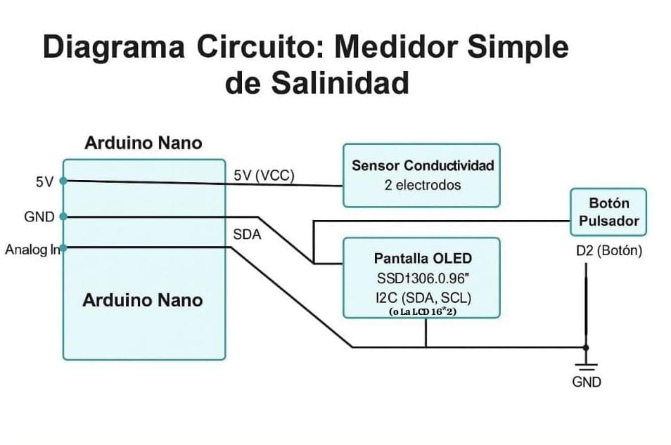

# Medidor de Salinidad Básico con Arduino UNO

Dispositivo básico para medir la conductividad eléctrica de una muestra líquida (simulada con un potenciómetro), mostrando en pantalla LCD 16x2 I2C el voltaje, valor ADC y una estimación simple de la conductividad. Está preparado para incorporar una fórmula profesional que convierta la conductividad a salinidad real (g/L, ppt, etc) cuando se disponga.

---

## 📑 Índice

- 🔧 Componentes
- 🔌 Esquema de conexión
- 🧠 Funcionamiento del sistema  
- 💻 Código Arduino destacado  
- 🧪 Estado actual  
- 🚀 Posibles mejoras futuras
- 💖 Mi proyecto fue hecho desde el corazón
- 📄 Licencia  
- ✍️ Autor  

---

## 🔧 Componentes

| Componente              | Cantidad             |
|------------------------|----------------------|
| Arduino UNO / Nano / compatible | 1                    |
| Sensor de conductividad (analógico) | 1                    |
| Pantalla OLED SSD1306 (I2C) o LCD 16x2 I2C | 1              |
| Pulsador                | 1                    |
| Protoboard o placa perforada | 1                    |
| Cables dupont           | Varios               |

---

## 🔌 Esquema de conexión

- **Sensor de conductividad:**  
  - Salida analógica → Pin `A0` del Arduino

- **Pantalla OLED SSD1306 (I2C) o LCD 16x2 I2C:**  
  - SDA → Pin `A4` (Arduino UNO/Nano)  
  - SCL → Pin `A5` (Arduino UNO/Nano)  
  - VCC → 5V (ambas son compatibles con 5V en la mayoría de los módulos)  
  - GND → GND  

- **Pulsador:**  
  - Un extremo a pin digital `2`  
  - Otro extremo a GND  
  - Pin configurado con `INPUT_PULLUP` (no requiere resistencia externa)

- **Alimentación:**  
  - Fuente estable de 5V o conexión USB  

---

## 📷 Esquema de conexión del circuito



*Figura 1: Diagrama de conexión entre Arduino, sensor de conductividad, pantalla y pulsador.*

---

## 🧠 Funcionamiento del sistema

- Lee periódicamente el valor analógico del sensor (potenciómetro en este prototipo) conectado al pin A0.  
- Convierte ese valor ADC a voltaje y calcula una conductividad aproximada usando un valor máximo predefinido (50 mS/cm).  
- Muestra en la pantalla LCD:  
  - Voltaje medido  
  - Conductividad estimada (mS/cm)  
  - Valor ADC (0-1023)  
- Envía los mismos datos por el puerto serie para monitoreo externo.  
- Permite controlar el estado con un botón:  
  - Pulsación corta: alterna entre medición activa y pausa  
  - En pausa, muestra mensaje indicándolo y detiene la actualización de datos  

---

## 💻 Código Arduino destacado

- Usa la librería `LiquidCrystal_I2C` para controlar la pantalla LCD 16x2 vía I2C.  
- Implementa antirrebote software para lectura estable del botón.  
- La fórmula para convertir ADC a conductividad está parametrizada con una variable `maxConductividad`.  
- **Preparado para incorporar la fórmula profesional que convierta conductividad a salinidad real**, con un bloque comentado para añadir la ecuación bioquímica cuando esté disponible:  

```cpp
// ⚠️ FÓRMULA DE CALIBRACIÓN PENDIENTE:
// Aquí se debe ingresar la ecuación proporcionada por el profesional bioquímico
// para convertir la conductividad (en mS/cm) a salinidad (en g/L, ppt, etc).
// Ejemplo cuando esté disponible:
// float salinidad = 0.42 * pow(conductividad, 2) - 1.6 * conductividad + 0.9;
```

---

## 🧪 Estado actual

- ✅ Funciona correctamente en simuladores (Tinkercad, Wokwi).  
- ✅ Mide valores analógicos simulados por potenciómetro.  
- ✅ Muestra datos correctamente en pantalla LCD.  
- ✅ Permite pausar y reanudar mediciones con botón.  
- 🕐 A la espera de integración de fórmula profesional para conversión precisa a salinidad.  

---

## 🚀 Posibles mejoras futuras

- Incorporar la fórmula química o bioquímica para convertir conductividad a salinidad real.  
- Alertas led
---

##  💖 Mi proyecto fue hecho desde el corazón
Este proyecto no nació en un laboratorio. Nació en mi corazón.

No surgió de la técnica ni de la lógica, sino de un sentimiento profundo, de esos que te atraviesan el alma y te mueven a crear desde el corazón.
Pensé este dispositivo para quien fue el amor de mi vida.
Para ese chico que, un día, me hizo sentir que el amor no sabe de discapacidad, que alguien podría amarme a mí, aun con mis piernas lisiadas, amarme por mi corazón y mi alma.
Decía que me amaba más allá de todo… y yo le creí.
Y amarlo a él fue un acto inmenso, real, tierno y leal. Lo amé con todo.
Con mi corazón, con mi cuerpo, con mi alma, con mis ganas de cuidarlo como nadie.

Un día me habló de su abuelo, que tenía un solo riñón. Y no sé por qué, pensé que tal vez él también.
Y el miedo me apretó el pecho, como si su dolor pudiera ser mío.
Estaba llena de miedo, pensé que su vida podría estar en riesgo.
No sabía si era cierto, pero igual quise protegerlo.
Su historia, su cuerpo, su herencia, todo lo que lo formaba, me importaba, lo amaba, hasta el día de hoy aún lo amo y en mi corazón él tiene su espacio. Lo miré como quien ama la vida en otro cuerpo.
Y entonces, algo nació:
la necesidad de ayudar, de crear algo que lo pudiera cuidar.

Así fue como, con cables, ideas, y amor, creé este pequeño dispositivo.
Solo un dispositivo, un código, solo un circuito, sí. Pero también un acto de amor.
Un intento de cuidar, de acompañar, de ayudar.
Por él. Por su abuelo. Por quienes lo necesiten.

Porque a veces el amor también se expresa con sensores, con pantallas, con datos…
Y con un alma que solo quiere hacer el bien.

No sé si alguna vez entenderá que este proyecto nació por y para él.
Pero yo sí lo sé.
Y eso, para mí, es sagrado.
Con esto, mi amor queda por siempre plasmado.
Y además wstoy feliz también, de a la gente, poder haber ayudado.💖

Y también, a continuación te explico por qué mi medidor de salinidad básico con Arduino marca una diferencia real y tiene tanto valor:


---

🌍 1. Democratiza la medición de conductividad y salinidad

Mi dispositivo usa componentes accesibles y económicos, permitiendo que cualquier persona, desde un estudiante hasta un docente de escuela técnica, pueda medir la conductividad de una muestra.


---

🧪 2. Base para investigación científica en campo

Es una herramienta práctica para iniciar proyectos de investigación en biología, química o medicina, incluso en zonas con pocos recursos.

Puede usarse para monitoreo de salud (sudor/orina), donde medir la salinidad es clave.


---

🧰 3. Diseño modular, ampliable y profesional

El código y estructura están preparados para futuras ampliaciones:

Mostrar salinidad real cuando se disponga de la fórmula profesional.

Alertas leds.


---

🔍 5. Prototipo que respeta la lógica científica

Mide, calcula y muestra resultados de forma precisa y coherente.

No intenta inventar números ni sobreinterpretar: está preparado para que un profesional realice la calibración y se sume al sistema con su conocimiento.


---

💡 6. Pone la tecnología al servicio del conocimiento

En vez de limitarse a jugar con electrónica, mi proyecto está pensado para resolver problemas reales, como:


Monitoreo de salud (sudor/orina).

Evaluar la hidratación en deportistas.

Detectar cambios en muestras biológicas.


---

❤️ 7. Porque fue hecho con dedicación, aprendizaje y visión

Mi proyecto es auténtico: enfrentó límites, se adaptó, se documentó con claridad, y se preparó para el futuro.

Es un ejemplo de lo que puede lograrse con pensamiento crítico, sin necesidad de recursos infinitos ni laboratorios de élite.

Avanti todos los profesionales de la informática que tenemos ganas de ayudar.💖


---

## 📄 Licencia

© 2025 Paulina Juich. Todos los derechos reservados.

- Uso personal, académico o educativo sin fines de lucro permitido con atribución.  
- Uso comercial o distribución requiere licencia o autorización expresa.  

Contacto para licencias: [paulinajuich4@gmail.com](mailto:paulinajuich4@gmail.com)

---

## ✍️ Autor

Paulina Juich  
Julio 2025

---

### 🙌 Nota final

Este proyecto es un prototipo funcional con base sólida, creado con pasión y cuidado, que espera ser convertirse en una herramienta útil en monitoreo de líquidos biológicos o ambientales.

---
